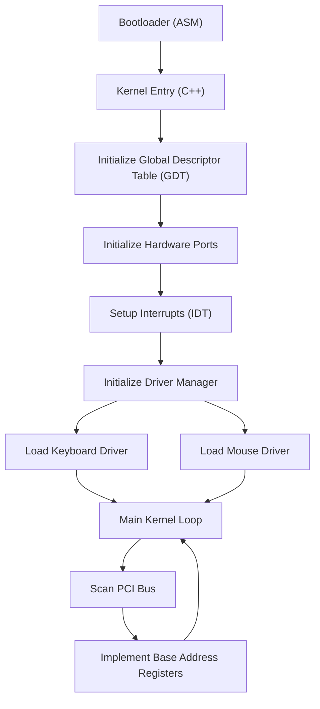

# 🚀 OS Concepts: Building a Kernel with C++, Assembly, and Make

<p align="center">
  <a href="https://github.com/ARMAANSINGHJANGRA/os-concepts-cpp-asm-make/stargazers"></a>
  <a href="https://github.com/ARMAANSINGHJANGRA/os-concepts-cpp-asm-make/network/members"></a>
  <a href="https://github.com/ARMAANSINGHJANGRA/os-concepts-cpp-asm-make/issues"></a>
</p>

## Short Description
Dive deep into the fascinating world of operating system development! This repository presents a meticulously structured, progressive journey into building a foundational kernel from the ground up. Leveraging the power of C++, Assembly, and robust Makefiles, it demystifies complex OS concepts through practical, hands-on implementation across distinct learning modules.

## ✨ Key Features
*   **Bare-Metal Bootstrapping:** Learn the essentials of setting up a loader and kernel entry point from scratch.
*   **Virtual Machine Integration:** Configure your nascent OS for execution within a virtualized environment.
*   **Memory Management Foundations:** Implement Global Descriptor Tables (GDT) to define memory segments.
*   **Direct Hardware Communication:** Master I/O port programming for low-level device interaction.
*   **Robust Interrupt Handling:** Develop an Interrupt Descriptor Table (IDT) and handlers for critical system events.
*   **Input Device Drivers:** Implement drivers for keyboard and mouse to enable user interaction.
*   **Modular Driver Architecture:** Establish clear abstractions for managing diverse hardware drivers.
*   **PCI Bus Enumeration:** Discover and interact with Peripheral Component Interconnect (PCI) devices.
*   **Base Address Register (BAR) Implementation:** Configure hardware resources for detected PCI devices.
*   **Progressive Learning Structure:** Each module builds upon the last, offering a clear learning path.

## Who is this for?
This project is an invaluable resource for:
*   **Aspiring Kernel Developers:** Gain practical experience in OS development fundamentals.
*   **Computer Science Students:** Reinforce theoretical OS concepts with real-world code.
*   **Low-Level Enthusiasts:** Explore the intricacies of hardware interaction and system programming.
*   **C++ and Assembly Developers:** Enhance your skills in bare-metal programming and build systems.

## Technology Stack & Architecture
This project is a testament to foundational computing principles, built upon:
*   **Languages:** C++ for higher-level kernel logic, Assembly (x86) for crucial boot-loader and interrupt-handling routines.
*   **Build System:** GNU Make for efficient compilation, linking, and image generation.
*   **Toolchain:** `g++`, `nasm`, `ld` (GNU Linker) for cross-compilation.
*   **Virtualization:** Designed for execution on a QEMU-like virtual machine environment.
*   **Core Concepts:** Global Descriptor Table (GDT), Interrupt Descriptor Table (IDT), I/O Port Addressing, Device Drivers (Keyboard, Mouse, PCI), and Memory Segmentation.

## 📊 Architecture & Database Schema
This project outlines the high-level architecture and boot process of a minimal operating system:



## ⚡ Quick Start Guide
To get this kernel running and explore its concepts, follow these steps:

1.  **Prerequisites:**
    *   `g++` (cross-compiler for i386-elf recommended)
    *   `nasm` (Netwide Assembler)
    *   `ld` (GNU Linker)
    *   `make` (GNU Make)
    *   `qemu-system-i386` (for running the kernel in a VM)

2.  **Clone the Repository:**
    ```bash
    git clone https://github.com/ARMAANSINGHJANGRA/os-concepts-cpp-asm-make.git
    cd os-concepts-cpp-asm-make
    ```

3.  **Navigate to a Chapter:**
    Choose any of the numbered directories, representing different stages of the kernel development. For example, to run the most advanced stage:
    ```bash
    cd "11 Implementing Base Address Registers"
    ```

4.  **Build the Kernel:**
    ```bash
    make all
    ```
    This will compile the C++ and Assembly source files and link them into an executable kernel image.

5.  **Run the Kernel in QEMU:**
    ```bash
    qemu-system-i386 -kernel mykernel.bin
    ```
    You should see the output of the kernel in the QEMU window, demonstrating the implemented functionalities.